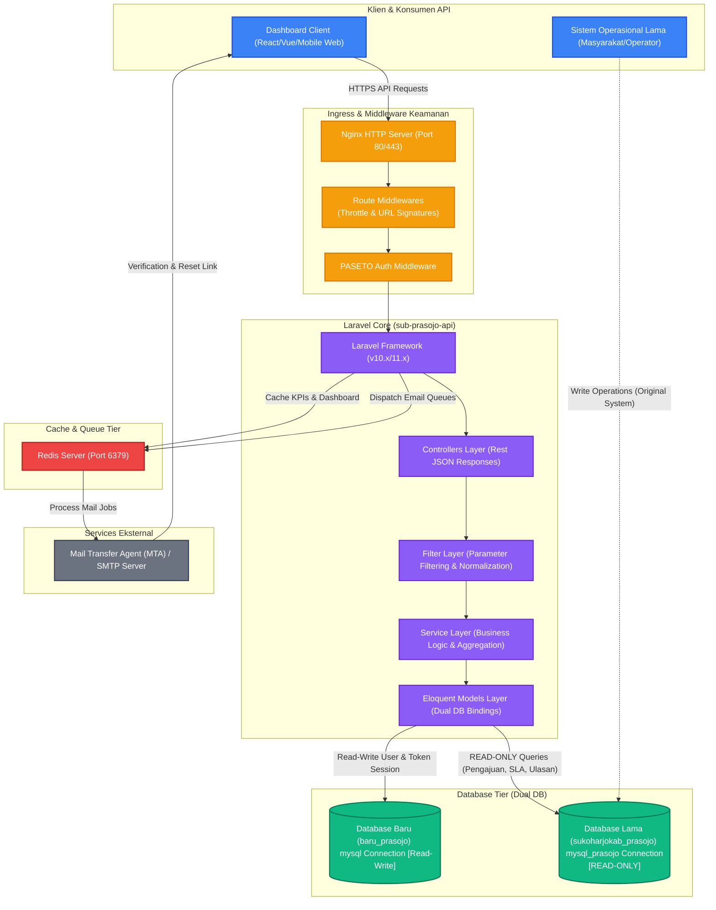
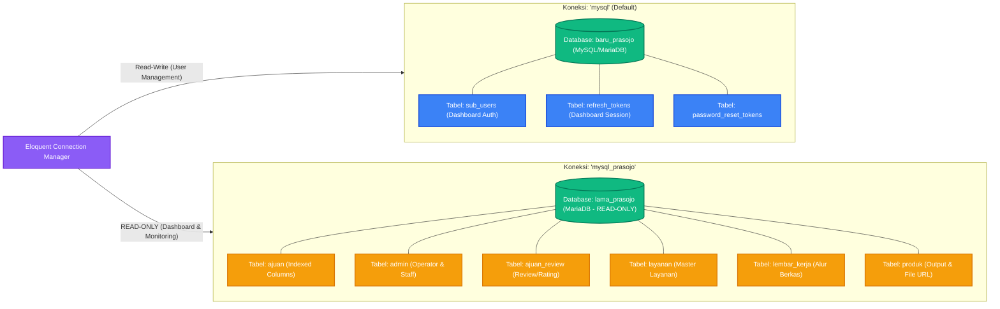

# Topologi Infrastruktur — Sub Prasojo API

Dokumen ini mendeskripsikan arsitektur dan topologi infrastruktur untuk proyek **Sub Prasojo API** (Sistem Monitoring Layanan Disdukcapil - Dashboard Eksekutif). Sistem ini menggunakan desain arsitektur modern berbasis Laravel dengan model **Dual-Database Connection** (Read-Write pada database User Dashboard, dan Read-Only pada database operasional lama).

---

## 1. High-Level Architectural Diagram

Diagram berikut menunjukkan bagaimana *request* mengalir dari klien melalui *middleware* keamanan, diproses oleh aplikasi Laravel, memanfaatkan *cache* Redis, dan berinteraksi dengan dua basis data yang berbeda secara bersamaan.

---

## 2. Diagram Aliran Data Dual-Database (Dual Connection Mapping)

Proyek ini menggunakan dua koneksi basis data yang harus dipisahkan dengan ketat untuk menjaga integritas data operasional:

---

## 3. Penjelasan Komponen Infrastruktur

### A. Klien & API Gateway (Ingress)
1. **Client Tier**: Executive Dashboard Frontend yang mengonsumsi endpoint API `/api/v1/*`. Membutuhkan performa tinggi karena memuat grafik trend, volume wilayah, dan peringkat operator secara *real-time*.
2. **Route Middleware (Throttle)**:
   - Membatasi *rate limiting* untuk mencegah brute-force dan eksploitasi API (misalnya `throttle:10,1` pada modul otentikasi login/register, dan `throttle:3,1` pada forgot password).
3. **Signed URLs**:
   - Memverifikasi otentisitas link verifikasi pendaftaran email melalui tanda tangan URL Laravel yang ditandatangani secara kriptografis (`middleware(['signed'])`).
4. **PASETO Authentication**:
   - Menggunakan **PASETO (Platform-Agnostic Security Tokens)** `Local v2` untuk pertukaran token secara *stateless* dan aman, menggantikan JWT konvensional.

### B. Aplikasi Core (Laravel - `sub-prasojo-api`)
1. **Controller Layer**:
   - Bertanggung jawab memvalidasi input *payload* melalui *Form Request* dan mengembalikan respon JSON terstandarisasi (Format Sukses `2xx` / Format Gagal `4xx` & `5xx` dalam Bahasa Indonesia).
2. **Service Layer**:
   - Memisahkan logika bisnis dari Controller (seperti perhitungan SLA, agregasi volume wilayah, perhitungan komparasi, dan *ranking* operator) untuk kepatuhan terhadap *Service Pattern* & *Clean Architecture*.
3. **Filter Layer**:
   - Melakukan standardisasi input penyaringan global seperti format tanggal dari `dd-mm-yyyy` (format input API) menjadi format `datetime` standar database melalui `Carbon::createFromFormat('d-m-Y', $value)`.
4. **Enums Layer**:
   - Mendefinisikan status-status transaksi (seperti status lembar kerja dan status produk) di tingkat kode Laravel guna menghindari adanya *hardcoded string* di tingkat *query*.

### C. Cache & Queue (Redis)
1. **Redis Cache Store**:
   - Digunakan untuk menyimpan hasil kalkulasi agregasi KPI Dashboard yang memakan sumber daya besar. Caching ini diimplementasikan di tingkat Service Layer untuk mengurangi beban pembacaan berulang ke database operasional.
2. **Redis Queue Connection**:
   - Digunakan untuk antrean pemrosesan tugas asinkronus (misalnya pengiriman email verifikasi dan pengubahan kata sandi) agar respon API tetap cepat tanpa terhambat proses I/O SMTP email.

### D. Dual-Database Tier
1. **Database Baru (`baru_prasojo`)**:
   - Koneksi default (`mysql`).
   - Sifat: **Read-Write**.
   - Berisi data manajemen pengguna aplikasi dashboard: `sub_users`, `refresh_tokens`, dan `password_reset_tokens`.
2. **Database Lama (`lama_prasojo` / `sukoharjokab_prasojo`)**:
   - Koneksi khusus (`mysql_prasojo`).
   - Sifat: **READ-ONLY**.
   - Berisi data operasional lama Disdukcapil (ajuan, admin, layanan, lembar_kerja, produk, review, ulasan, wilayah, dsb).
   - Pengoptimalan: Migrasi dilakukan hanya untuk menambahkan indeks (Index) guna menunjang kecepatan query visualisasi data tanpa mengubah struktur tabel operasional asli.

---

## 4. Mekanisme Keamanan & Optimasi Kinerja

Untuk menjamin kestabilan dan performa tinggi pada infrastruktur ini, aturan-aturan berikut wajib diterapkan secara ketat:

### 1. Read-Only Enforcement (Koneksi Prasojo)
Seluruh interaksi data operasional lama (koneksi `mysql_prasojo`) tidak diperkenankan melakukan aksi perubahan data (INSERT, UPDATE, DELETE). Eloquent Model yang terhubung dengan tabel operasional diset dengan `$timestamps = false` dan mematikan fungsi penulisan default Laravel.

### 2. Optimasi Database Indexing
Untuk mempercepat pembacaan data statistik dari tabel operasional `ajuan` yang memiliki jutaan baris data, indeks ditambahkan ke kolom-kolom strategis berikut:
- `ajuan_status` (Untuk memilah berkas selesai, ditolak, dll)
- `ajuan_create_datetime` & `ajuan_update_datetime` (Penyaringan berdasarkan periode dan komparasi SLA)
- `ajuan_no_reg` (Pencarian cepat nomor registrasi)
- `ajuan_kecamatan_code` (Penyaringan wilayah)
- `ajuan_is_online` & `ajuan_pelapor_role_name` (Penyaringan jalur pelaporan)
- `ajuan_pelapor_id` (Relasi monitoring operator)

### 3. Pencegahan N+1 Query (CRITICAL)
N+1 query dilarang keras karena dapat memperlambat pemrosesan dan membebani server database.
- **Eager Loading**: Semua relasi model Eloquent yang akan diproses dalam perulangan (*loop*) atau diserialisasikan ke JSON (seperti relasi `pelapor` dan `layanan` pada `Ajuan`) wajib dimuat menggunakan `with()` atau `loadMissing()`.
- **Custom SQL Aggregation**: Menggunakan `DB::raw()` atau query *join* jika pengambilan data relasional terlalu kompleks agar perhitungan statistik diselesaikan langsung di tingkat mesin database dalam satu kali query tunggal.
